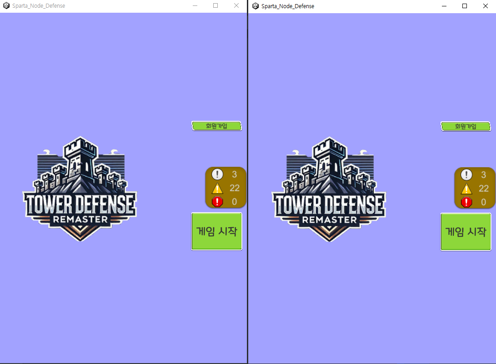
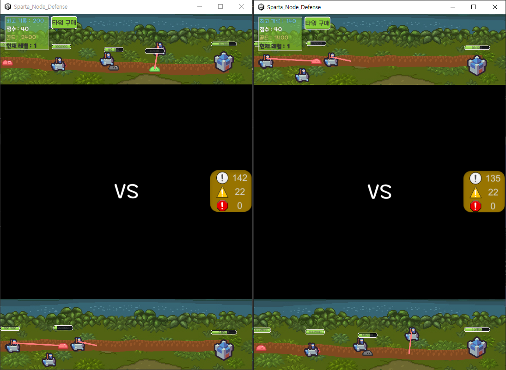
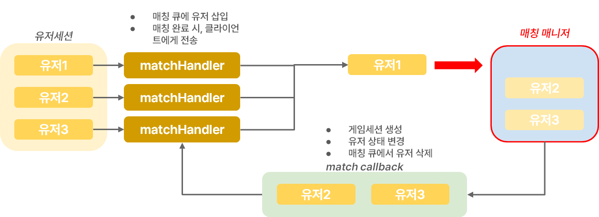
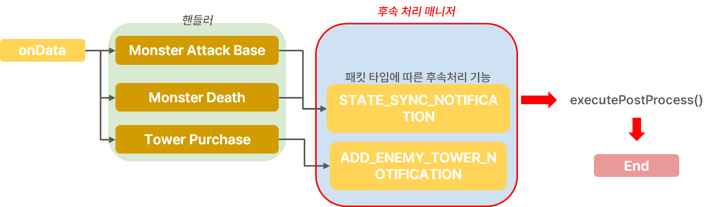
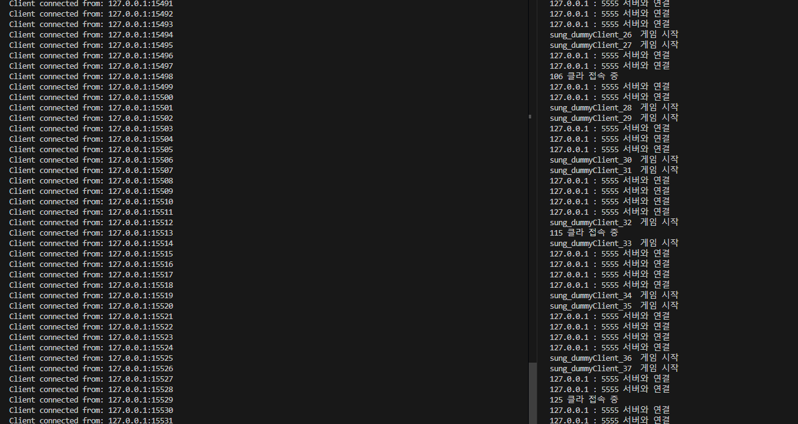

# online-tower-defense

챕터 5. 온라인 타워 멀티 디펜스 프로젝트

# tower-defense

[팀스파르타 Node.js 6기] 5챕터 팀 프로젝트 - 온라인 타워 디펜스

## Preview





## 파일 구조

```
📦ROOT
 ┣ 📂.vscode
 ┃ ┗ 📜launch.json
 ┣ 📂client
 ┃ ┗ 📜dummyClient.js
 ┣ 📂src
 ┃ ┣ 📂assets
 ┃ ┃ ┣ 📜initial.json
 ┃ ┃ ┗ 📜monster.json
 ┃ ┣ 📂classes
 ┃ ┃ ┣ 📂managers
 ┃ ┃ ┃ ┣ 📜databaseManager.js
 ┃ ┃ ┃ ┣ 📜matchingManager.js
 ┃ ┃ ┃ ┗ 📜processManager.js
 ┃ ┃ ┗ 📂models
 ┃ ┃ ┃ ┣ 📜baseClass.js
 ┃ ┃ ┃ ┣ 📜gameClass.js
 ┃ ┃ ┃ ┣ 📜monsterClass.js
 ┃ ┃ ┃ ┣ 📜towerClass.js
 ┃ ┃ ┃ ┗ 📜userClass.js
 ┃ ┣ 📂config
 ┃ ┃ ┗ 📜config.js
 ┃ ┣ 📂constants
 ┃ ┃ ┣ 📜env.js
 ┃ ┃ ┣ 📜header.js
 ┃ ┃ ┗ 📜state.js
 ┃ ┣ 📂database
 ┃ ┃ ┗ 📂query
 ┃ ┃ ┃ ┗ 📂user
 ┃ ┃ ┃ ┃ ┗ 📜user.queries.js
 ┃ ┣ 📂events
 ┃ ┃ ┣ 📜onConnection.js
 ┃ ┃ ┣ 📜onData.js
 ┃ ┃ ┣ 📜onEnd.js
 ┃ ┃ ┗ 📜onError.js
 ┃ ┣ 📂handlers
 ┃ ┃ ┣ 📂base
 ┃ ┃ ┃ ┗ 📜monsterAttackBaseHandler.js
 ┃ ┃ ┣ 📂game
 ┃ ┃ ┃ ┣ 📜gameEndHandler.js
 ┃ ┃ ┃ ┗ 📜matchHandler.js
 ┃ ┃ ┣ 📂monster
 ┃ ┃ ┃ ┣ 📜deathMonsterHandler.js
 ┃ ┃ ┃ ┗ 📜spawnMonsterHandler.js
 ┃ ┃ ┣ 📂tower
 ┃ ┃ ┃ ┣ 📜towerAttackHandler.js
 ┃ ┃ ┃ ┗ 📜towerPurchaseHandler.js
 ┃ ┃ ┣ 📂user
 ┃ ┃ ┃ ┣ 📜loginHandler.js
 ┃ ┃ ┃ ┗ 📜registerHandler.js
 ┃ ┃ ┗ 📜index.js
 ┃ ┣ 📂init
 ┃ ┃ ┣ 📜index.js
 ┃ ┃ ┣ 📜loadAssets.js
 ┃ ┃ ┣ 📜loadProcessInitializer.js
 ┃ ┃ ┗ 📜loadProtos.js
 ┃ ┣ 📂protobufs
 ┃ ┃ ┣ 📂auth
 ┃ ┃ ┃ ┗ 📜auth.proto
 ┃ ┃ ┣ 📂common
 ┃ ┃ ┃ ┗ 📜gamePacket.proto
 ┃ ┃ ┣ 📂game
 ┃ ┃ ┃ ┣ 📜combat.proto
 ┃ ┃ ┃ ┣ 📜gameData.proto
 ┃ ┃ ┃ ┣ 📜gameEvent.proto
 ┃ ┃ ┃ ┗ 📜match.proto
 ┃ ┃ ┣ 📂global
 ┃ ┃ ┃ ┗ 📜global.proto
 ┃ ┃ ┣ 📜packetMaps.js
 ┃ ┃ ┗ 📜packetNames.js
 ┃ ┣ 📂sessions
 ┃ ┃ ┣ 📜gameSession.js
 ┃ ┃ ┣ 📜sessions.js
 ┃ ┃ ┗ 📜userSessions.js
 ┃ ┣ 📂utils
 ┃ ┃ ┣ 📂errors
 ┃ ┃ ┃ ┣ 📜customError.js
 ┃ ┃ ┃ ┣ 📜errorCodes.js
 ┃ ┃ ┃ ┗ 📜errorHandler.js
 ┃ ┃ ┣ 📂game
 ┃ ┃ ┃ ┗ 📂data
 ┃ ┃ ┃ ┃ ┣ 📜createGameData.js
 ┃ ┃ ┃ ┃ ┗ 📜generatePath.js
 ┃ ┃ ┣ 📂packet
 ┃ ┃ ┃ ┣ 📂parser
 ┃ ┃ ┃ ┃ ┗ 📜packetParser.js
 ┃ ┃ ┃ ┗ 📂response
 ┃ ┃ ┃ ┃ ┗ 📜createResponse.js
 ┃ ┃ ┣ 📂socket
 ┃ ┃ ┃ ┗ 📜sequence.js
 ┃ ┃ ┗ 📜dateFormatter.js
 ┃ ┗ 📜server.js
 ┣ 📜.env
 ┣ 📜.gitattributes
 ┣ 📜.gitignore
 ┣ 📜.prettierrc
 ┣ 📜package-lock.json
 ┣ 📜package.json
 ┗ 📜README.md
```

## 프로젝트 목표

### 1. **게임 서버 설계 및 구현**

- [x] 타워 디펜스 게임의 기본 규칙을 이해하고 있다.
- [x] 게임 서버의 주요 기능 (회원가입, 로그인, 게임 데이터 관리 등)을 설계할 수 있다.
- [x] TCP를 이용해 클라이언트와 서버 간 실시간 통신을 구현할 수 있다.
- [x] 대전 대기열 기능을 구현할 수 있다.
- [x] 클라이언트 요청에 따라 적절한 게임 데이터를 처리하고 응답할 수 있다.

### 2. **패킷 명세 작성**

- [x] TCP 통신 기반의 패킷 명세를 작성할 수 있다.
- [x] Protocol Buffers를 사용하여 패킷 구조를 정의할 수 있다.
- [x] 패킷의 종류들과 어떤 시점에 어떤 패킷을 보내야 하는지 이해하고 있다.
- [x] 회원가입 / 로그인 등 모든 기능에 대한 패킷 명세를 완료했다.

### 3. **ERD 설계**

- [x] 유저 테이블과 유저의 게임 기록 테이블을 설계할 수 있다.
- [x] ERD를 기반으로 데이터베이스 스키마를 작성할 수 있다.

### 4. **프로젝트 관리 및 협업**

- [x] Git을 사용해 소스 코드 버전 관리를 할 수 있다.
- [x] Git branch를 이용해 브랜치 관리 및 협업을 할 수 있다.
- [x] Pull Request와 코드 리뷰 과정을 이해하고 준수할 수 있다.

### 5. **클라이언트 연동 및 테스트**

- [x] 제공된 게임 클라이언트를 이용해 서버와 TCP 기반으로 통신할 수 있다.
- [x] 상태 동기화에 대해서 이해하고 이에 필요한 게임 이벤트들을 정의할 수 있다.

## 주요 기능

### 1. 매칭 매니저를 통한 매칭 시스템 구현



### 2. 후속 처리 매니저를 통한 패킷 타입에 따른 후속 처리 시스템 구현



### 3. 더미 클라이언트를 통한 다클라 패킷 송수신 테스트



- 과부하 테스트를 위해 작성
- 100 ~ 500 더미 클라를 접속해도 지연 상황 없이 패킷을 처리하는 것을 확인
- 패킷을 처리할 때, 여러 명의 유저에 대한 데이터를 처리하지 않고, 방에 접속해 있는 유저 2명에 대한 패킷만을 처리하기 때문에 지연 상황에 대한 이슈가 없는 것으로 추측

## 트러블슈팅

### 1. 패킷 송수신

#### [발단]

- 페이로드에서 oneof 프로토버프를 읽는 과정이 필요

#### [목표]

- 클라이언트와 공통된 프로토버프 메시지로 송수신이 원활하게 되어야 함

#### [문제]

- 프로토버프의 데이터형 제한, ushort, ubytes 형식 사용 불가
- oneof 형태의 프로토버프 인코딩 / 디코딩 문제

#### [해결]

- 수신 시 직접 버퍼를 읽도록 수정 및 페이로드는 약속한 프로토버프로 디코딩
- 클라이언트와 약속한 객체의 이름으로 매핑하여 응답

### 2. 매칭 시스템

#### [발단]

- 유저를 매칭시켜 matchStartNotification 이라는 매칭 성공 응답 패킷을 보내야 함

#### [목표]

- 유저가 원활하게 매칭이 되고 게임을 진행시킬 수 있도록 해야 함

#### [문제]

- 유저 검색 루프가 콜 스택에 쌓이게 되고 처리가 되지 않으면서 블로킹 발생
- 따라서 매칭 시스템을 비동기적으로 처리해야 함

#### [해결]

- 싱글톤 형식으로 매칭 매니저 구현, 매칭 인스턴스 내의 큐에 유저를 추가하여 블로킹 없이 유저 탐색 진행
- 콜백 함수로 매칭 처리, 유저가 매칭 될 시, 콜백 함수가 실행되어 게임세션에 접속

### 3. 후속처리 시스템

#### [발단]

- 상태 동기화라는 응답 패킷을 보내주어야 함

#### [목표]

- 특정 이벤트를 처리하면 상태 동기화 패킷을 보내주도록 구현하고자 함

#### [문제]

- 공통적인 후속 처리를 각 핸들러마다 작성
- 이로 인해 코드의 복잡성 증가 및 가독성 저하 문제 발생

#### [해결]

- 후속 처리 매니저 구현
  - 후속 패킷을 한 곳에서 일괄적으로 관리하고, 동일 기능의 후속 처리 패킷의 중복 코드를 방지
- 비동기 후속 처리 방식 도입
  - await handler()가 작동된 이후에 후속 처리를 확인하고 실행하도록 진행

### 4. 타워 공격

#### [발단]

- 클라이언트에서 타워를 구매하면 미리 오브젝트를 생성하고 배치한 다음 서버에서 받은 아이디를 부여하는 상태

#### [목표]

- 서버는 클라이언트에서 준 타워 좌표로 게임데이터에 타워를 저장하고 타워아이디를 클라이언트에게 보냄

#### [문제]

- 서버에서 타워 아이디를 클라이언트에게 보내주기 전, 타워가 몬스터를 공격하는 현상 발생
- 이로 인해 타워 ID 없이 타워 공격에 대한 패킷을 전달 받음

#### [해결]

- 서버: 타워ID 중복 회피
  - 임시로 타워ID를 1부터 시작
- 클라: 타워ID가 유효한 값일 때만 공격을 허용
  - 클라이언트에서 타워ID가 0 또는 null인 경우, 공격에 제한

### 5. 강제 종료 후 게임 처리

#### [발단]

- 게임이 진행중일 때 한 쪽에서 소켓 연결을 끊으면 게임 결과 처리를 해야 함

#### [목표]

- 게임 진행 도중 소켓 연결이 끊긴 대상은 패배처리하도록 함

#### [문제]

- 게임이 정상 종료되고 결과가 출력되는 시간 중 소켓 연결이 끊기면 승패가 바뀌는 현상 발생
- session과 연결을 끊지만 이를 onEnd()에서 확인하지 않아 발생

#### [해결]

- onEnd()에서 session과 연결이 끊어졌는지 확인
